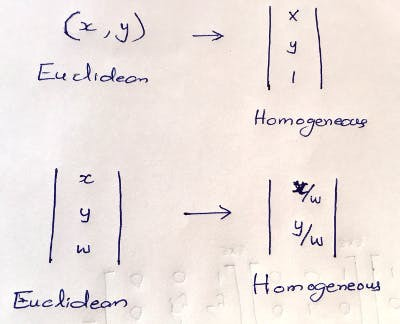

# ADAS: Collision Avoidance System on Indian Roads
_Real-world implementation of ADAS L0 - CAS on Indian Roads - using LIDAR-Camera Low-Level Sensor Fusion_

This solution aims **to augment even the least expensive cars in India with an ultra-cheap ADAS Level 0, i.e. collision avoidance and smart surround-view.** Modern cars with a forward-collision warning (FCW) system or autonomous emergency braking (AEB) are very expensive, but we can augment such functions on old cars, at a low cost.

# Project Demo

**Watch the gadget plying Indian Roads**, giving driver-assist alerts after perceiving the surrounding objects, their depth and direction.

[](https://youtu.be/6XW5p3OjkIA)


# Bill of Materials

<p align="center">
  
</p>


# How to Use?

**Please execute the commands in this order**, so that by the time the object detection module runs the LIDAR and Flash modules will be up and running. Object detection module is the publish node while the other two are subscriber nodes.

To run the LIDAR distance estimation Subscribe module:
```python
python3 lidar_getdist.py 
```

To run the Flash Warning Subscriber Module:
```python
python3 pulse_mqtt.py 
```

To run the main object detection Publish Module:
```python
python3 object_detection_demo.py -i 0 -m ssdlite_mobilenet_v2/ssdlite_mobilenet_v2.xml -at ssd --labels ~/open_model_zoo/data/dataset_classes/coco_91cl.txt -d MYRIAD --output_resolution 640x480
```

# Project Description

The idea is to **use a battery-powered Pi connected with a LIDAR, Pi Cam, LED SHIM, and NCS 2, mounted on the car bonnet to perceive frontal objects with their depth & direction.** This not only enables a forward-collision warning system but also smart driver assistance that gives alerts about traffic signs or pedestrians, walking along the roadside, or crossing the road.

Cameras generally have higher resolution than LiDAR but cameras have a limited FOV and can't estimate distance. **While rotating LIDAR has a 360° field of view, Pi Cam has only 62x48 degrees Horizontal x Vertical FoV.** As we deal with multiple sensors here, we need to employ **visual fusion techniques** to integrate the sensor output, that is to get the distance and angle of an obstacle in front of the vehicle. Let's first discuss the theoretical foundation of sensor fusion before hands-on implementation.

## The Idea of Sensor Fusion

Each sensor has its own advantages and disadvantages. Take, for instance, RADARs are low in resolution, but are good at measurement without a line of sight. **In an autonomous car, often a combination of LiDARs, RADARs, and Cameras are used to perceive the environment.** This way we can **compensate for the disadvantages, by combining the advantages of all sensors.**

- **Camera:** excellent to understand a scene or to classify objects
- **LIDAR:** excellent to estimate distances using pulsed laser waves
- **RADAR:** can measure the speed of obstacles using Doppler Effect

The camera is a 2D Sensor from which features like bounding boxes, traffic lights, lane divisions can be identified. LIDAR is a 3D Sensor that outputs a set of point clouds. **The fusion technique finds a correspondence between points detected by LIDAR and points detected by the camera.** To use LiDARs and Cameras in unison to build ADAS, the 3D sensor output needs to be fused with 2D sensor output by doing the following steps.

1. **Project the LiDAR point clouds (3D) onto the 2D image.**
2. **Do object detection** using an algorithm like YOLOv4.
3. **Match the ROI** to find the interested LiDAR projected points.

By doing the 3 steps above, the surrounding objects would be measured and classified using LIDAR-Camera fusion.

## LIDAR-Camera Sensor Fusion Considerations
When a raw image from a cam is merged with raw data from RADAR or LIDAR then it's called **Low-Level Fusion or Early Fusion.** In Late Fusion, detection is done before the fusion. Note that there are many challenges to project the 3D LIDAR point cloud on a 2D image. **The relative orientation and translation between the two sensors must be considered in performing fusion.**

- **Rotation:** The coordinate system of LIDAR and Camera can be different. Distance on the LIDAR may be on the z-axis, while it is x-axis on the camera. **We need to apply rotation on the LIDAR point cloud to make the coordinate system the same**, i.e. multiply each LIDAR point with the Rotation matrix.
- **Translation:** In an autonomous car, the LIDAR can be at the center top and the camera on the sides. The position of LIDAR and camera in each installation can be different. Based on the relative sensor position, **translate the LIDAR Points by multiplying with a Translation matrix.
- **Stereo Rectification:** For stereo camera setup, we need to do Stereo Rectification to make the left and right images co-planar. Thus, we need to multiply with matrix R0 to align everything along the horizontal Epipolar line.
- **Intrinsic calibration:** Calibration is the step where you tell your camera how **to convert a point in the 3D world into a pixel.** To account for this, we need to multiply with an intrinsic calibration matrix containing factory calibrated values.

To sum it up, we **need to multiply LIDAR points with all the 4 matrices** to project on the camera image.

**To project a point X in 3D onto a point Y in 2D,

<p align="center">
  
</p>

- **P = Camera Intrinsic Calibration matrix
- **R0 = Stereo Rectification matrix
- **R|t = Rotation & Translation to go from LIDAR to Camera
- **X = Point in 3D space
- **Y = Point in 2D Image

Note that we have combined both the rigid body transformations, rotation, and translation, in one matrix, R|t. Putting it together, the 3 matrices, P, R0, and R|t account for extrinsic and intrinsic calibration to project LIDAR points onto the camera image. However, the matrix values highly **depend on our custom sensor installation.**

## Real-World Implementation with RPi & RPLIDAR A1

First, we need to assemble the Pi with RPLIDAR A1, Pi Cam, LED SHIM, and NCS 2. 2D LIDAR is used instead of 3D LIDAR as we aim to make the gadget, cheapest possible. The unit is powered by a 5V 3A 10K mAH battery. For ease of assembly, a LIDAR mount is 3D printed and attached to the RPi. Part of the mount design is taken from the STL files obtained from 

Connect RPLIDAR A1 with the USB adapter that is connected to the Pi USB using a micro-USB cable. LIDAR's adapter provides power and converts LIDAR's internal UART serial interface to a USB interface. Use an Aux-to-Aux cable to connect RPi to speakers. Due to physical constraints, an **LED SHIM is used instead of Blinkt** to signal warning messages. While the total cost of the ADAS gadget is just around US$ 150–200, one may have to shell out at least $10–20K more, to get a car model with such advanced features.

**Let's imagine, a 3D LIDAR is connected** the same way as above. First, **we will try to solve 3D LIDAR-Camera Sensor Fusion** on the above gadget. **Then we will see the variation for 2D LIDAR-Camera Fusion, so as to make it work on RPLIDAR A1.**

<p align="center">
  
</p>

## 3D LIDAR-Camera Sensor Fusion

It is clear from the above discussion that **we need to do rotation, translation, stereo rectification, and intrinsic calibration to project LIDAR points on the image.** We will try to apply the above formula based on the custom gadget that we built.

From the above image, you can estimate the **Pi Cam is 10 mm below the LIDAR scan plane. i.e. a translation of [0, -10, 0] along the 3D-axis. Consider Velodyne HDL-64E as our 3D LIDAR, which requires 180° rotation to align the coordinate system with Pi Cam. We can compute the R|t matrix now.**

As we use a monocular camera here, the **stereo rectification matrix will be an identity matrix.** We can make the intrinsic calibration matrix based on the hardware spec of Pi Cam V2.

<p align="center">
  
</p>

For the **RaspberryPi V2 camera,**
- **Focal Length (FL)** = 3.04 mm
- **FL Pixels** = focal length * sx, where sx = real world to pixels ratio
- **Focal Length * sx** = 3.04mm * (1/ 0.00112 mm per px) = 2714.3 px

Due to a mismatch in shape, the matrices cannot be multiplied. To make it work, we need to **transition from Euclidean to Homogeneous coordinates by adding 0's and 1's as the last row or column.** After doing the multiplication we need to **convert back to Homogeneous coordinates.**


<p align="center">
  
</p>

You can see the **3DLIDAR-CAM sensor fusion projection output after applying the projection formula on the 3D point cloud.** The input sensor data from 360° Velodyne HDL-64E and camera is downloaded [9] and fed in.

<p align="center">
  
</p>

However, the 3D LiDAR cost is a barrier to build a cheap solution. We can **instead use cheap 2D LiDAR with necessary tweaks**, as it only scans a single horizontal line.

## 2D LIDAR-Camera Sensor Fusion

Our gadget is equipped with 2D RP LIDAR A1 to minimize the cost. **This LIDAR scans the environment in a 2D plane, orthogonal to the camera plane. The rotating scan will estimate the distance to the obstacle, for each angle from 0° to 360°. Due to the placement of LIDAR w.r.t. Pi Cam in the gadget, the camera is at +90° on the LIDAR geometry. However, note that the Field of View of Pi cam V2 is 62°x48° in horizontal x vertical direction respectively.**

The **integrated front view of the device** is as shown below.


<p align="center">
  
</p>

As **both the LIDAR and Camera sensor data is available in the frontal 62° arc, we need to fuse the data.** In the LIDAR scan plane, the camera data starts from +59° to +59° + 62° = 121°. **We can run object detection on the image** to get bounding boxes for the objects of interest. Eg: human, car, bike, traffic light, etc. **Since 2D LIDAR has only width information, consider only the x_min and x_max of each bounding box.**

We need to compute the LIDAR angle corresponding to an image pixel, in order to estimate the distance to the pixel. **To find the distance to the object inside the bounding box, compute θ_min and θ_max corresponding to x_min & x_max using the below formula**, based on the above diagram,

<p align="center">
  
</p>

Now you can **find the distance to each angle between θ_min and θ_max based on the latest LIDAR scan data. Then compute the median distance of all LIDAR points that subtends the object bounding box to estimate the object depth.** If the distance is below a threshold, then trigger a warning based on the angle. Repeat warning, only if the box center shift by a significant distance in subsequent frames.

**To build a non-blocking system flow, a modular architecture is employed wherein, each independent node is dependent on different hardware components.** i.e., the "object detection" node uses Movidius for inference, whereas the "distance estimation" node takes LIDAR data as input, while the "Alert" module signals to Pimoroni Blinkt and the speaker. The modules are communicated via MQTT messages on respective topics.


# Architecture Diagram


<p align="center">
  
</p>

The **time synchronization module takes care of the "data relevance factor" for Sensor Fusion.** For ADAS, the location of detected objects by 'Node 1' may change, as the objects move. Thus, the distance estimate to the bounding box could go wrong after 2–3 seconds (while the message can remain in the MQTT queue). In order to synchronize, current time = 60*minutes + seconds is appended to the message (to ignore lagged messages).

The model output is sent from Node 1 to Node 2, where the LiDAR-Cam sensor fusion happens, further pushing a message to Node 3. **For the system to function, the 3 MQTT nodes should work in tandem, orchestrated by MQTT messages, published, and subscribed on respective topics.**

**This ADAS device can be connected to the CAN bus** to let it accelerate, steer, or apply the brake. RPi doesn't have a built-in CAN Bus, but its GPIO includes SPI Bus, which is supported by a number of CAN controllers like MCP2515. So, autonomous emergency braking (AEB) and collision avoidance system (CAS) can be done by connecting this device to the CAN bus.

# Tweaking for Indian Conditions

The Indian traffic conundrum is so unique that it demands custom solutions. To start with, **we need to train object detection models with Indian vehicles such as trucks, tempos, vans, autos, cycle rickshaws, etc.**

Further, to enhance smart surround view, **we need to train the model with Indian traffic signs and signboards** to give more meaningful driver-assist warnings on Indian roads. It's a common sight in India, the animals like cows, pigs, buffaloes, goats, dogs, etc., cross the roads and highways. Hence, it's beneficial to detect them as well. To find out the ROI from images, we have used SSD MobileNet trained on COCO filtered by potential objects. To detect only people and vehicles, you can use this model also to get better speed and accuracy.

For the PoC, **see the output of SSD-Mobilenet model trained to classify Indian traffic signs against Indian signboards.** You can further classify the traffic sign to decipher the exact meaning of the sign.


<p align="center">
  
</p>

_The annotated Indian Traffic Sign dataset is provided by Datacluster Labs, India. They are yet to finish the annotation of "Indian Vehicles" database. It's just a matter of training time to make this gadget, tailor-made for India._


# References
1. LIDAR-Camera Sensor Fusion High Level: https://www.thinkautonomous.ai/blog/?p=lidar-and-camera-sensor-fusion-in-self-driving-cars
2. LIDAR data scan code stub by Adafruit:https://learn.adafruit.com/remote-iot-environmental-sensor/code
3. Camera Calibration and Intrinsic Matrix Estimation: https://www.cc.gatech.edu/classes/AY2016/cs4476_fall/results/proj3/html/agartia3/index.html
4. Visual Fusion For Autonomous Cars Course at PyImageSearch University: https://www.pyimagesearch.com/pyimagesearch-university/
5. LIDAR Distance Estimation:https://en.wikipedia.org/wiki/Lidar
6. RPLIDAR A1 M8 Hardware Specification:https://www.generationrobots.com/media/rplidar-a1m8-360-degree-laser-scanner-development-kit-datasheet-1.pdf
7. Model Training, Data Cleansing & Augmentation:www.roboflow.com
8. The Indian traffic sign model has been trained using the Traffic dataset offered by Datacluster Labs, India.
